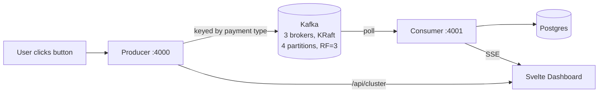
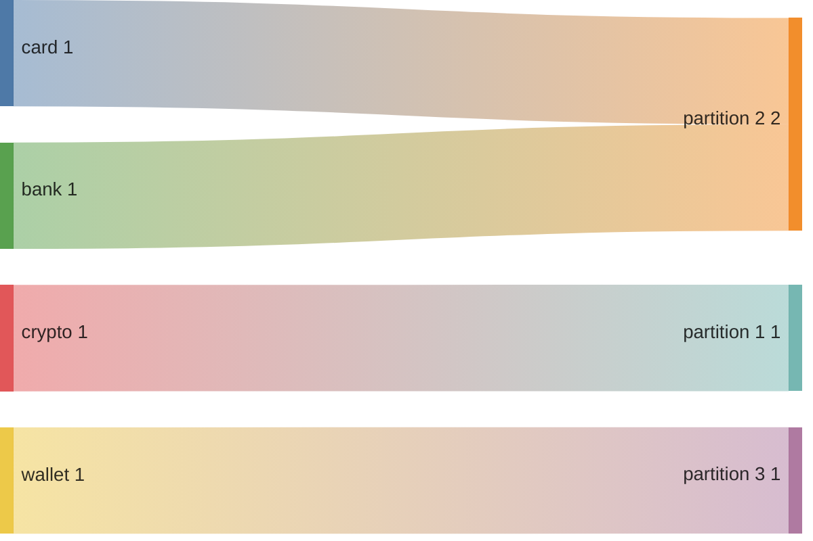

# payflow

A demo of Kafka partition routing, replication, and consumer groups,
themed around payment transactions — built by running and breaking a real
3-broker cluster.

## What it does

Click a payment button and watch the event flow live through a real Kafka
cluster: producer → partition → consumer → Postgres → dashboard, via SSE.



Dashboard shows live partition lanes, cluster state (brokers, controller,
leader/ISR per partition), consumer group state (lag, members), and stats.

## Stack

Python + FastAPI + `confluent-kafka` (`uv`) · Svelte + Vite (`pnpm`) ·
Postgres 16 · `confluentinc/cp-kafka:7.6.1`, 3 brokers, KRaft, 4 partitions,
RF=3, `min.insync.replicas=2`

## Running it

```bash
make up
```

- Frontend: http://localhost:5173
- Producer API: http://localhost:4000
- Consumer API: http://localhost:4001

`make help` for all commands, including broker kill/restart for the failover
demo below.

## Why one partition can end up empty

Kafka hashes each key (`murmur2(key) % num_partitions`) to pick a partition.
With only 4 keys across 4 partitions, two keys can collide onto the same one,
leaving another empty — the pigeonhole principle, not a bug. The same key
always lands on the same partition; ordering is only guaranteed within a
partition, not across partitions.



## Failover demo

```bash
make kill-broker-1
```

Watch Cluster State live: ISR shrinks (`isr=[2,3,1]` → `isr=[2,3]`), leader
election happens automatically for any partition broker 1 led, no data loss
(2 replicas still meet `min.insync.replicas=2`), consumer group stays
`STABLE` throughout.

```bash
make restart-broker-1
```

Broker 1 rejoins and fully re-syncs into ISR — but Kafka does not hand
leadership back automatically. It stays wherever the last election put it
unless you set `auto.leader.rebalance.enable=true` or trigger it manually.

Same commands exist for brokers 2 and 3 — any broker can be leader or
controller.
